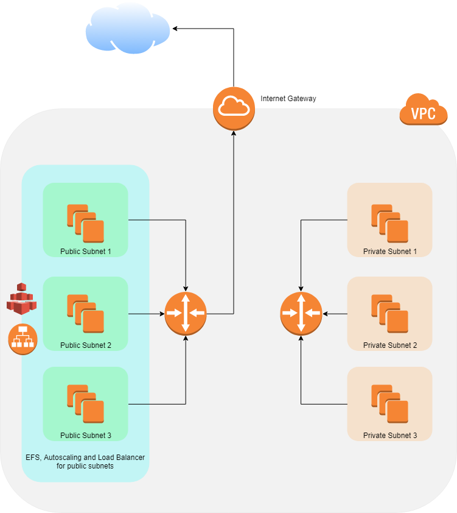

# cloudformation-exercise

AWS CloudFormation provides a common language for you to describe and provision all the infrastructure resources in your cloud environment. CloudFormation allows you to use a simple text file to model and provision, in an automated and secure manner, all the resources needed for your applications across all regions and accounts. This file serves as the single source of truth for your cloud environment.

Nested stacks are stacks created as part of other stacks. You create a nested stack within another stack by using the AWS::CloudFormation::Stack resource.

The structure of the CloudFormation files its simple!

```
AWSTemplateFormatVersion: (Not necessary)

Description: (Not necessary)

Metadata: (Not necessary)

Parameters: (Not necessary)

Mappings: (Not necessary)

Conditions: (Not necessary)

Transform: (Not necessary)

Resources: (Necessary!)

Outputs: (Not necessary)

```
 The sections that we are using in this proyect are the Parameters, Resources and the Outputs section.

 The 'Parameters' are going to be the values that we will be passing in our nested stacks, the 'Resources' are the AWS resources of the services that we want to use in our cloud enviroment. And the 'Outputs' are the resources that we want to use in other nested stacks.

## What does this CloudFormation file do:

This proyect works with 5 stacks.

- The VPC stack will create a VPC with 6 subnets in it, 3 are public and 3 private. The public subnets will have an internet gateway to comunicate with the outside world.

- The SG stack will create a Security Group for the VPC.

- The EFS stack will create a EFS volume and will attach it to the public subnets.

- The ASG stack will create a Lauch Configuration with simple EC2 instances that contain instructions to install nginx and mount the EFS volume. Also is going to add the 3 public subnets to an Auto Scaling Group and a Load Balancer.

- The main stack is in charge to link all the stacks and send them all the parameters needed.

## Cool Diagram:
<p align="center">
  
</p>

## How to use it:

1. Create a S3 bucket and upload all the files.

2. Go to CloudFormation service and select create a stack.

3. Select template is ready and Amazon S3 URL and copy the main.yml url of your S3 bucket.

4. Fill the parameters.

5. Select next and wait a few minutos.

Then you will see that all the specified resources and services are created.
